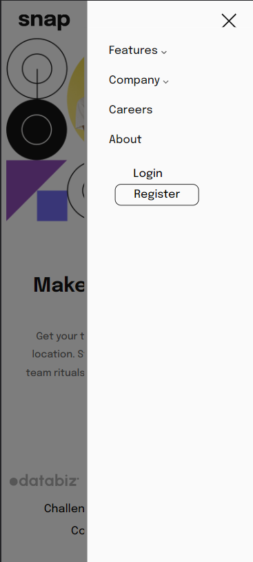

# Frontend Mentor - secção de introdução com solução de navegação dropdown

Esta é uma solução para a [secção de introdução com o desafio de navegação dropdown no Frontend Mentor](https://www.frontendmentor.io/challenges/intro-section-with-dropdown-navigation-ryaPetHE5). Os desafios do Frontend Mentor ajudam-no a melhorar as suas capacidades de codificação através da construção de projectos realistas. 

## Tabela de conteúdos

- [Visão Geral](#overview)
  - [O Desafio](#o desafio)
  - [Captura de ecrã](#screenshot)
  - [Links](#links)
  - [Construído com](#built-with)

- [Autor](#autor)

## Visão geral

### O desafio

Os utilizadores devem ser capazes de o fazer:

- Ver os menus dropdown relevantes no ambiente de trabalho e no telemóvel ao interagir com as ligações de navegação
- Ver a disposição óptima do conteúdo, dependendo do tamanho do ecrã do seu dispositivo
- Ver os estados de flutuação para todos os elementos interactivos na página

### Imagem de ecrã

### Ligações

- URL da solução: [Adicione aqui o URL da solução](https://your-solution-url.com)
- URL do sítio em directo: [Adicione aqui o URL do sítio em directo](https://your-live-site-url.com)

## O meu processo

#### Construído com

- HTML5 
- CSS
- Flexbox
- Grid
- JavaScript

## Autor

- Website - [SirReinato](https://www.your-site.com)
- Frontend Mentor - [@SirReinato](https://www.frontendmentor.io/profile/SirReinato)
- Twitter - [@Sir_Reinato](https://twitter.com/Sir_Reinato)

